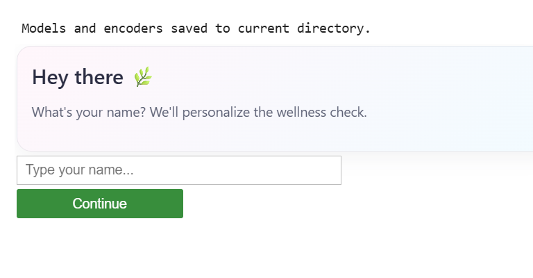
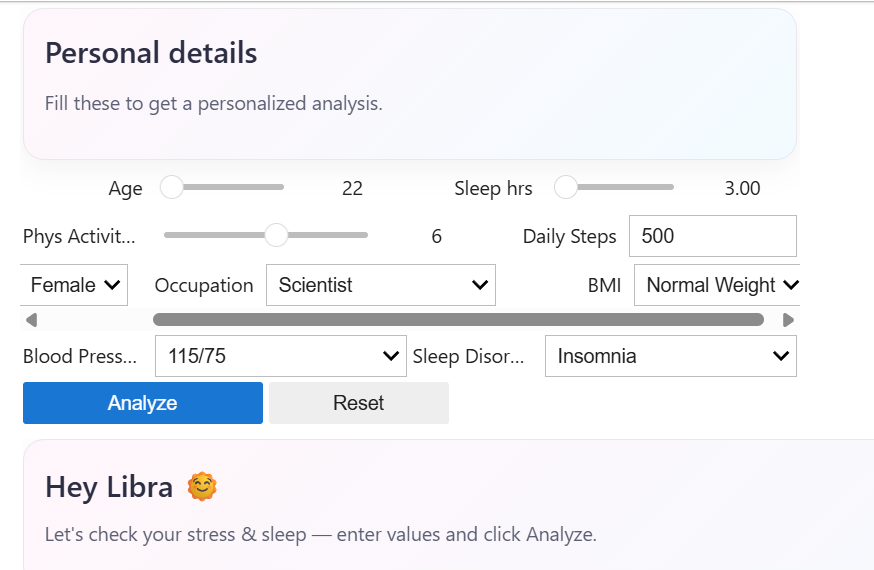
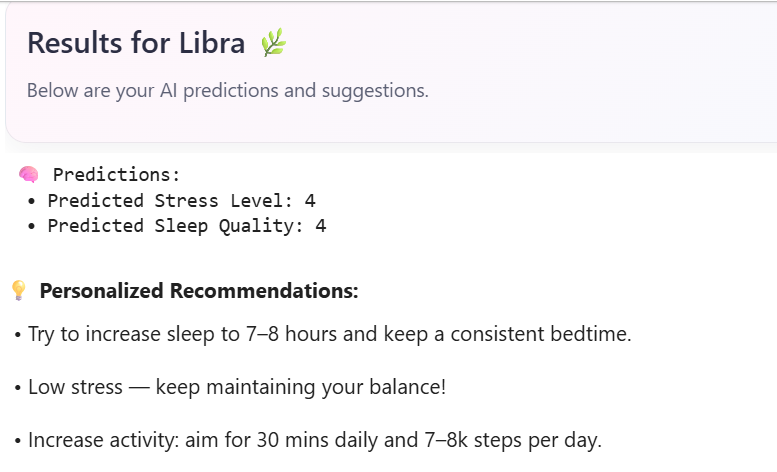
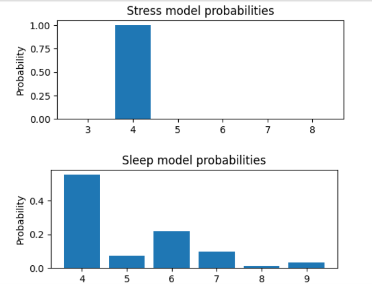
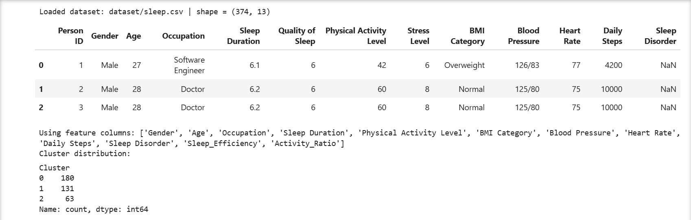
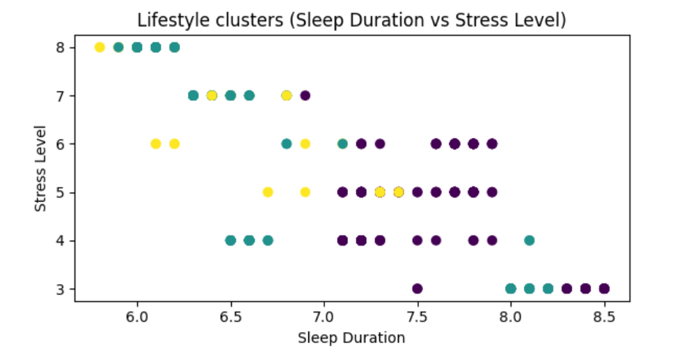
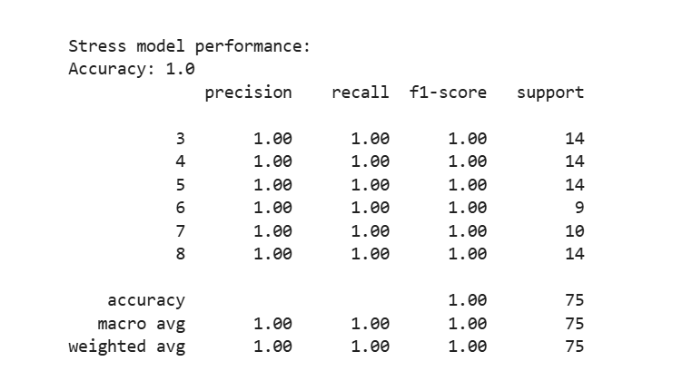
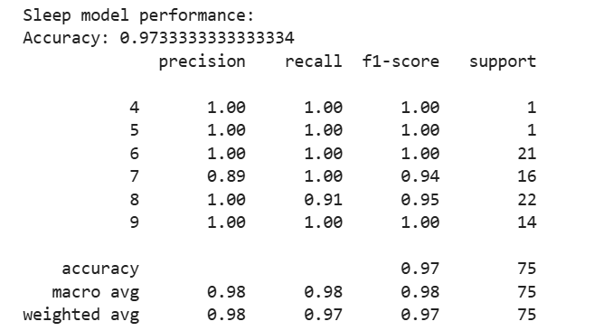
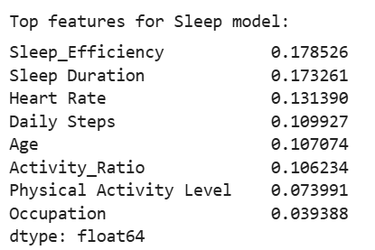
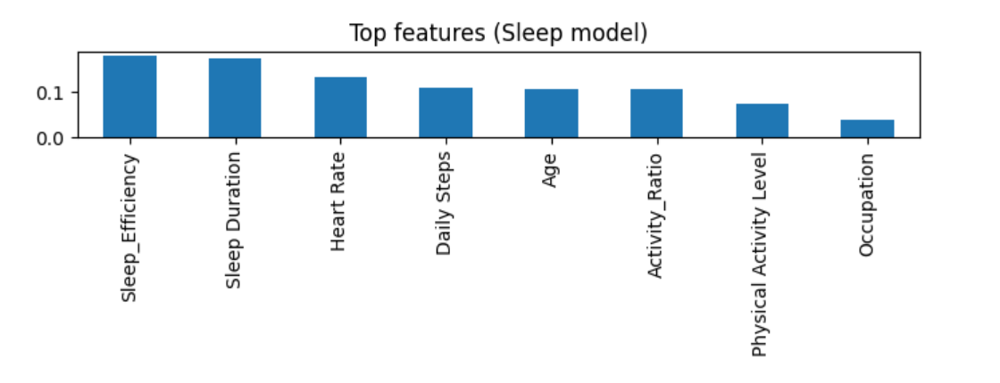

# 🌿 Stress & Sleep Wellness Analyzer

A machine learning project that predicts **stress levels** and **sleep quality** using lifestyle and health data.
The system also provides **personalized wellness recommendations** based on AI predictions and behavioral patterns.

This project demonstrates the application of **machine learning, feature engineering, clustering analysis, and interactive data visualization** to understand how lifestyle factors influence wellbeing.

---

# 📌 Project Overview

Modern lifestyles often negatively impact sleep and stress levels.
This project analyzes lifestyle attributes such as:

* Sleep duration
* Physical activity
* Daily steps
* Occupation
* BMI
* Blood pressure
* Sleep disorders

Using machine learning models, the system predicts:

* **Stress Level**
* **Quality of Sleep**

It also generates **personalized wellness recommendations** and identifies **lifestyle clusters**.

---

# 🚀 Key Features

✔ Data preprocessing and cleaning
✔ Feature engineering
✔ Stress level prediction using **MLP Neural Network**
✔ Sleep quality prediction using **Random Forest**
✔ Lifestyle pattern discovery using **K-Means Clustering**
✔ Feature importance analysis
✔ Interactive user interface using **ipywidgets**
✔ Personalized health recommendations

---

# 🧠 Machine Learning Models Used

| Model                      | Purpose                     |
| -------------------------- | --------------------------- |
| **MLPClassifier**          | Predict stress level        |
| **RandomForestClassifier** | Predict sleep quality       |
| **KMeans Clustering**      | Identify lifestyle clusters |

---

# 📊 Interface Preview

### Welcome Screen



---

### User Input Interface



---

### Prediction Results



---

### Model Probability Visualization



---

# 📂 Dataset Overview

The dataset contains lifestyle and physiological attributes such as:

* Age
* Gender
* Occupation
* Sleep Duration
* Physical Activity Level
* Daily Steps
* BMI Category
* Blood Pressure
* Heart Rate
* Sleep Disorder

Target variables:

* **Stress Level**
* **Quality of Sleep**

### Dataset Preview



---

# 🔬 Lifestyle Clustering

K-Means clustering is used to identify patterns in lifestyle behaviors.

This helps group individuals based on similar health and lifestyle habits.



---

# 📈 Model Performance

### Stress Prediction Model



Accuracy achieved:

**1.00**

---

### Sleep Quality Prediction Model



Accuracy achieved:

**~0.97**

---

# 🔍 Feature Importance Analysis

The Random Forest model identifies the most influential factors affecting sleep quality.

### Feature Importance Values



### Feature Importance Chart



Important contributing factors include:

* Sleep Efficiency
* Sleep Duration
* Heart Rate
* Daily Steps
* Age
* Physical Activity Level

---

# 🧮 Techniques Used

This project demonstrates multiple data science techniques:

* Data Cleaning
* Label Encoding
* Feature Engineering
* Model Training
* Model Evaluation
* Clustering Analysis
* Data Visualization
* Interactive UI Development

---

# ⚙️ Technologies Used

* Python
* Pandas
* NumPy
* Scikit-learn
* Matplotlib
* ipywidgets
* Joblib

---

# 📁 Project Structure

```
stress-sleep-wellness-analyzer
│
├── dataset
│   └── sleep.csv
│
├── notebook
│   └── stress_sleep_analysis.ipynb
│
├── images
│   ├── ui_welcome.png
│   ├── ui_inputs.png
│   ├── prediction_results.png
│   ├── model_probabilities.png
│   ├── dataset_preview.png
│   ├── cluster_plot.png
│   ├── stress_model_performance.png
│   ├── sleep_model_performance.png
│   ├── feature_importance.png
│   └── feature_importance_chart.png
│
├── requirements.txt
└── README.md
```

---

# 🧑‍💻 How to Run the Project

### 1️⃣ Clone the repository

```
git clone https://github.com/YOUR_USERNAME/stress-sleep-wellness-analyzer.git
```

---

### 2️⃣ Install dependencies

```
pip install -r requirements.txt
```

---

### 3️⃣ Run the notebook

Open the notebook:

```
stress_sleep_analysis.ipynb
```

Run all cells to train the models and launch the interactive wellness interface.

---

# 💡 Example Output

The system predicts:

* Stress Level
* Sleep Quality

And generates:

* Personalized health recommendations
* Lifestyle cluster classification
* Model probability visualization

---

# 🎯 Project Goal

The goal of this project is to demonstrate how **machine learning can be applied to wellness analytics** by analyzing lifestyle data and predicting health-related outcomes.

---

# 👩‍💻 Author

Machine Learning Portfolio Project
